# Event Booking System

This is a MERN (MongoDB, Express.js, React, Node.js) stack application for managing and booking events. Users can browse available events, book tickets securely using Razorpay, and receive email notifications. Administrators have full control over event creation, modification, and deletion.

## Table of Contents

1.  [Project Overview](#project-overview)
2.  [Tech Stack](#tech-stack)
3.  [Key Features](#key-features)
4.  [Setup Instructions](#setup-instructions)
    *   [Prerequisites](#prerequisites)
    *   [Backend Setup](#backend-setup)
    *   [Frontend Setup](#frontend-setup)
5.  [How to Run the Application](#how-to-run-the-application)
6.  [Screenshots](#screenshots) (To be added after setup)

## Project Overview

The Event Booking System provides a robust platform for both event organizers and attendees. Key functionalities include:
*   User authentication (registration, login, role-based access control).
*   Browsing and filtering of upcoming events.
*   Secure online ticket booking with Razorpay integration.
*   Automated email notifications for booking confirmations and event reminders.
*   An administrative dashboard for comprehensive event management.
*   Dynamic handling of event statuses (Upcoming/Completed) based on dates.

## Tech Stack

*   **Backend:** Node.js, Express.js, MongoDB (via Mongoose), JWT for authentication, Nodemailer for emails, Razorpay for payments, `node-cron` for scheduling.
*   **Frontend:** React.js, React-Bootstrap for UI components, Axios for API calls, React Router for navigation.

## Key Features

*   **User Authentication:** Secure user registration, login, and protected routes based on user roles (User/Admin).
*   **Event Browsing:** Users can view a list of available events, with options to filter by date, price, and location.
*   **Event Details:** Detailed view for each event, including description, date, location, price, and available seats.
*   **Secure Booking & Payment:** Integration with Razorpay for secure online payment processing. Users can specify the number of seats they wish to book.
*   **Real-time Availability:** Event seat availability is updated in real-time upon booking.
*   **Email Notifications:**
    *   Welcome email upon successful user registration.
    *   Booking confirmation email after successful payment.
    *   Event reminder emails sent 30 minutes before an event (via cron job).
*   **Dynamic Event Status:** Events are automatically marked as "Completed" if their date has passed, affecting display and booking options.
*   **Admin Dashboard:**
    *   Create, edit, and delete events.
    *   View all events, including their status.
    *   Edit/Delete actions are disabled for completed events.
*   **Responsive Design:** Implemented with React-Bootstrap to provide a responsive user interface across various devices.

## Setup Instructions

### Prerequisites

Before you begin, ensure you have the following installed on your system:

*   **Node.js**: `v18.x` or later (e.g., `v18.18.0`)
    *   Verify with: `node -v`
*   **npm**: `v9.x` or later (e.g., `v9.8.7`)
    *   Verify with: `npm -v`
*   **MongoDB**: Make sure you have a MongoDB instance running, either locally or a cloud-based service like MongoDB Atlas.

### Backend Setup

1.  **Navigate to the backend directory:**
    ```bash
    cd event/backend
    ```
2.  **Install dependencies:**
    ```bash
    npm install
    ```
3.  **Create a `.env` file:** In the `event/backend` directory, create a file named `.env` and add the following environment variables. Replace the placeholder values with your actual credentials.

    ```
    PORT=5000
    MONGO_URI=your_mongodb_connection_string
    JWT_SECRET=your_jwt_secret_key
    RAZORPAY_KEY_ID=your_razorpay_key_id
    RAZORPAY_KEY_SECRET=your_razorpay_key_secret
    EMAIL_HOST=your_email_smtp_host (e.g., smtp-relay.brevo.com for Brevo/Sendinblue)
    EMAIL_PORT=your_email_smtp_port (e.g., 587)
    EMAIL_USER=your_email_smtp_username (e.g., 9e1b7f001@smtp-brevo.com for Brevo)
    EMAIL_PASS=your_email_smtp_password
    EMAIL_FROM=your_sender_email@example.com
    EMAIL_FROM_NAME="Event Booking Team"
    ```
    *   **`MONGO_URI`**: Your MongoDB connection string. For a local MongoDB, it might be `mongodb://localhost:27017/eventbooking`.
    *   **`JWT_SECRET`**: A strong, random string for JWT token signing.
    *   **`RAZORPAY_KEY_ID` & `RAZORPAY_KEY_SECRET`**: Obtain these from your Razorpay dashboard (test or live mode).
    *   **`EMAIL_HOST`, `EMAIL_PORT`, `EMAIL_USER`, `EMAIL_PASS`, `EMAIL_FROM`, `EMAIL_FROM_NAME`**: These are for Nodemailer. If using Brevo (formerly Sendinblue), refer to their SMTP settings. `EMAIL_USER` is typically the Brevo SMTP login. `EMAIL_FROM` should be a verified sender email in your Brevo account.

### Frontend Setup

1.  **Navigate to the frontend directory:**
    ```bash
    cd event/frontend
    ```
2.  **Install dependencies:**
    ```bash
    npm install
    ```
3.  **Create a `.env` file:** In the `event/frontend` directory, create a file named `.env` and add the following environment variables.

    ```
    REACT_APP_API_URL=http://localhost:5000/api
    REACT_APP_RAZORPAY_KEY_ID=your_razorpay_key_id
    ```
    *   **`REACT_APP_API_URL`**: This should match the port your backend is running on.
    *   **`REACT_APP_RAZORPAY_KEY_ID`**: This should be the same Razorpay Key ID you used in the backend.

## How to Run the Application

1.  **Start the Backend Server:**
    ```bash
    cd event/backend
    npm install
    npm start
    ```
    The backend server will start on `http://localhost:5000`.

2.  **Start the Frontend Development Server:**
    ```bash
    cd event/frontend
    npm install
    npm start
    ```
    The frontend application will open in your browser, usually at `http://localhost:3000`.

## Screenshots

*   *Registration Page*
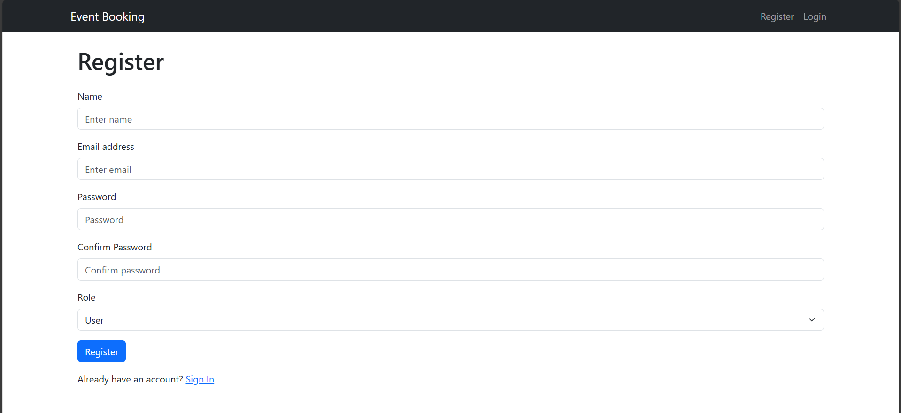


*   *Login Page*
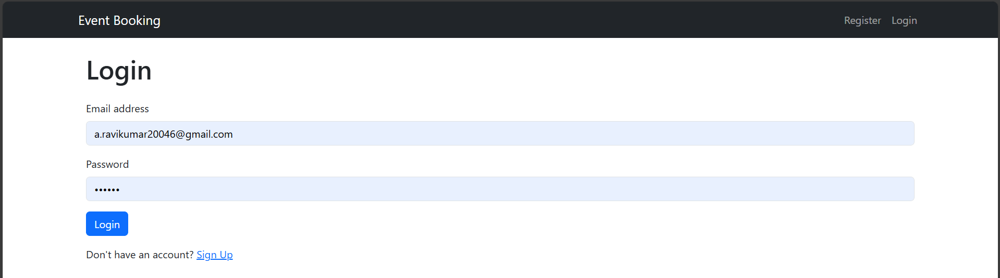


*   *User Dashboard (showing available events and your bookings)
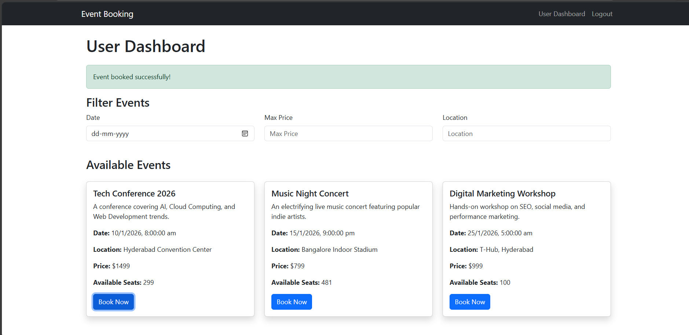

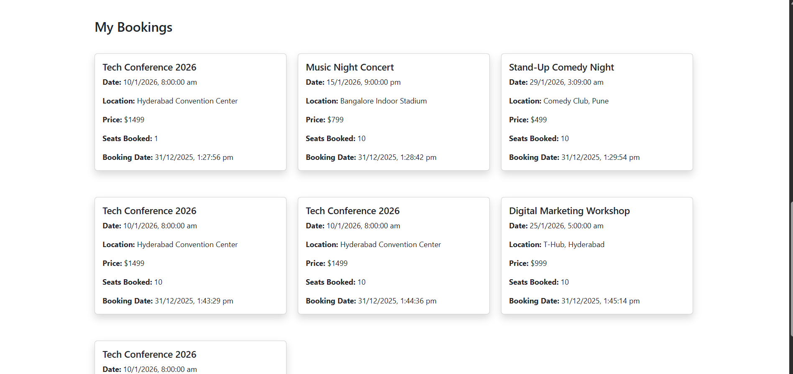

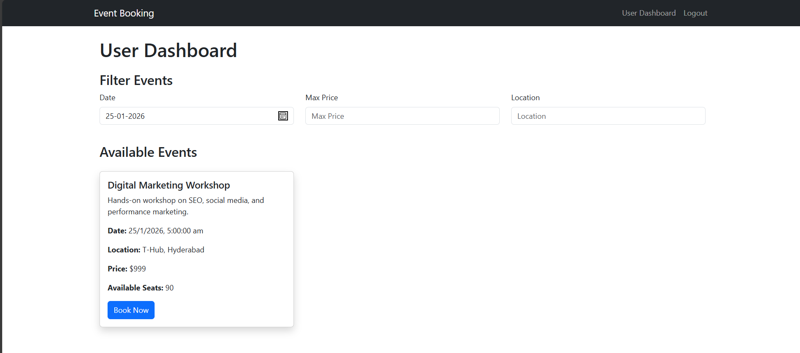


*   *Event Details/Booking Modal (showing seat selection and Razorpay button)*
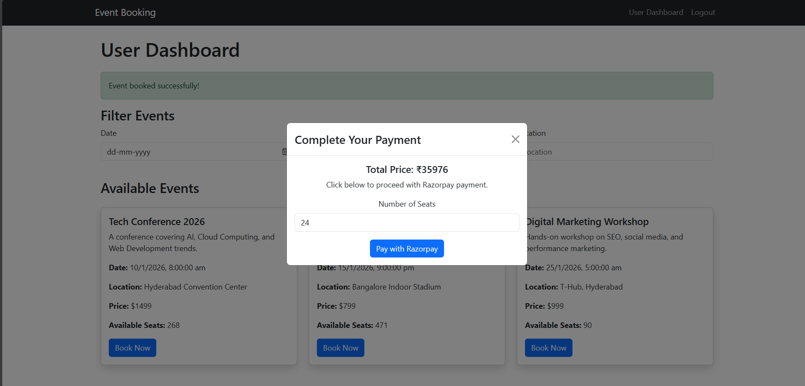

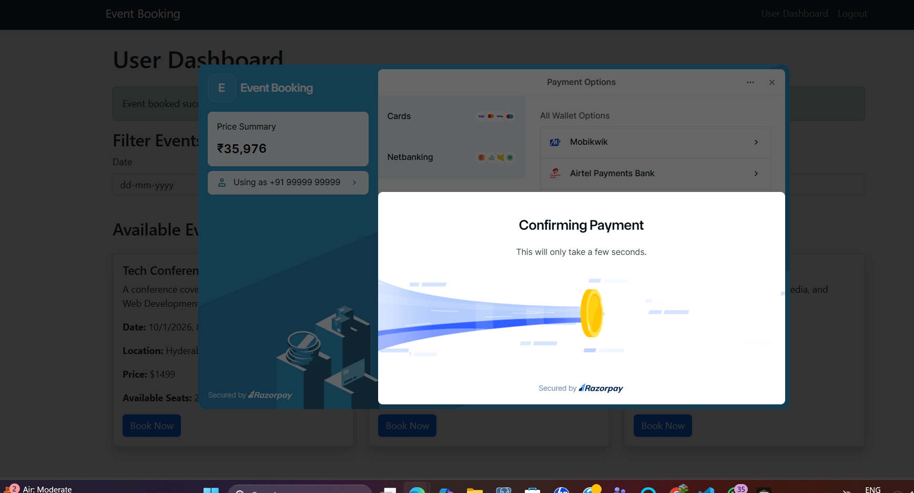


*   *Admin Dashboard (showing event list, create/edit buttons, and status badges)*
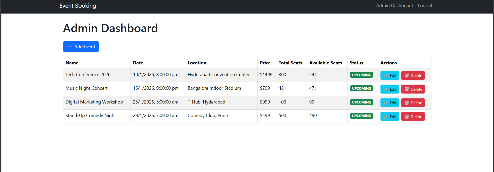

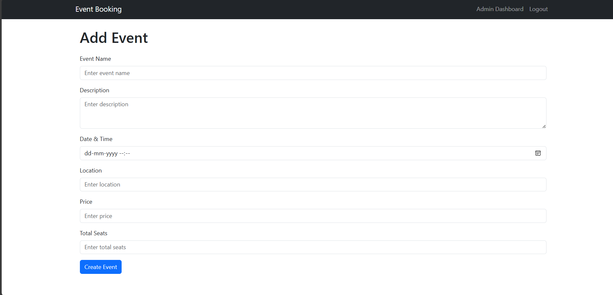


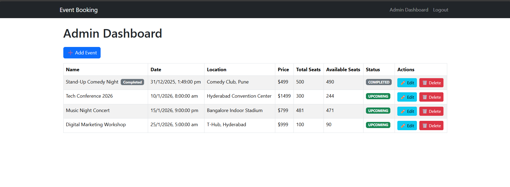

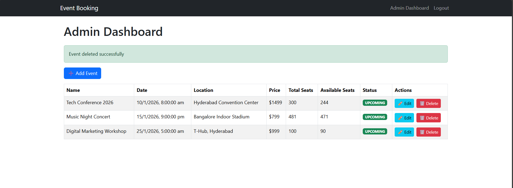

---


